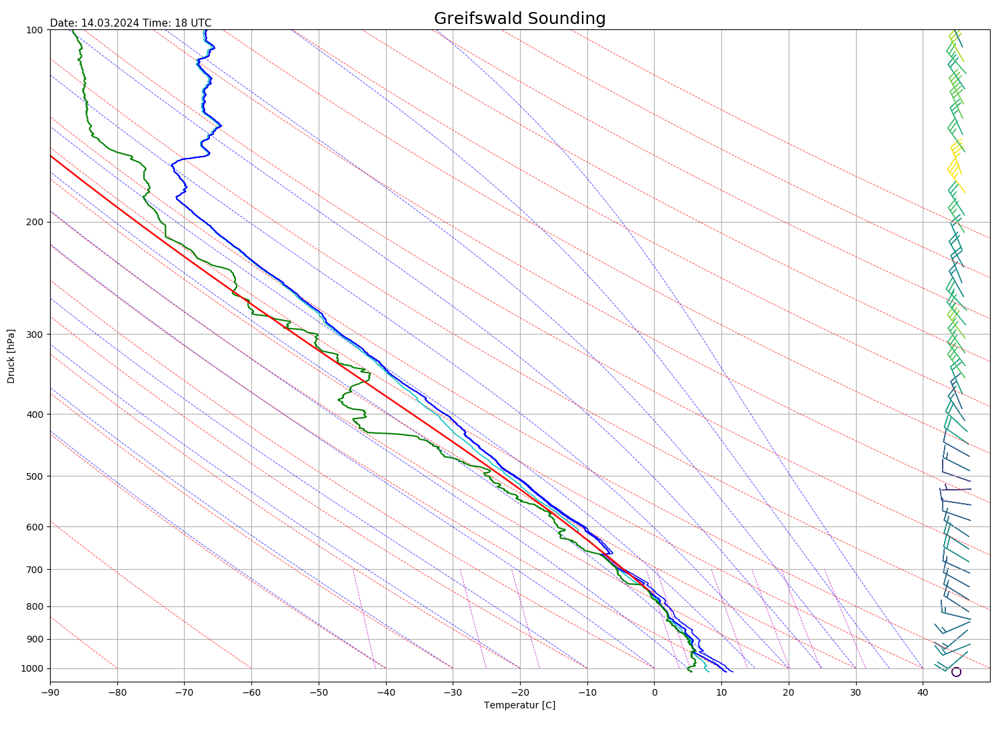
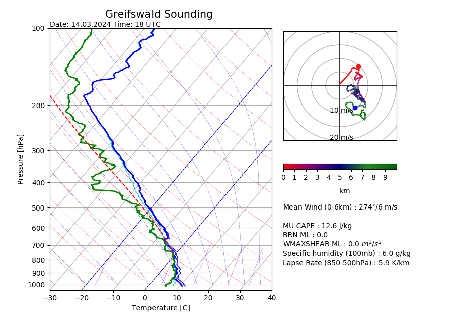
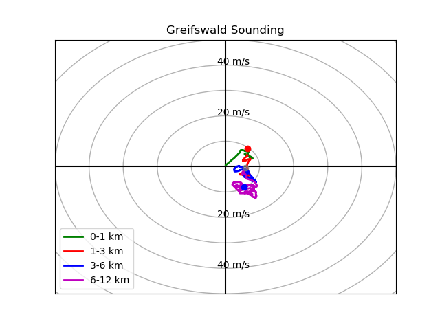
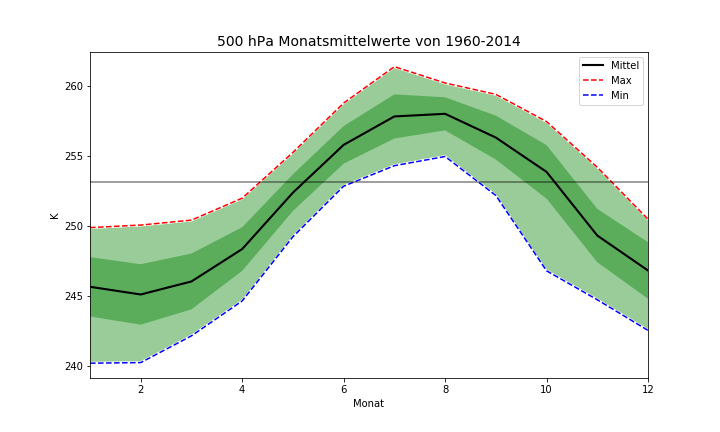
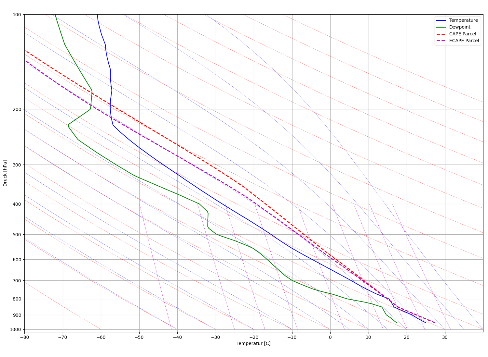

# Sounding Analyze

Goal of this analyze sounding software is to compare and improve algorithm.

## Installation

**Conda**

```bash
conda env create -f environment.yml

conda activate SoundingAnalyze
```
## How to run?
```bash
python3 run_uwyo.py 2024-06-18 12 10548
#or
python3 run_cm1.py
```

## Example









**ECAPE**


