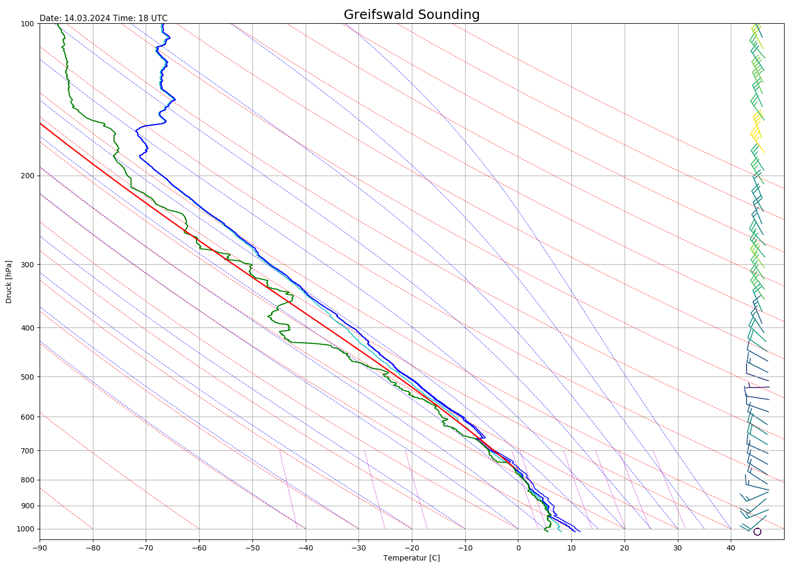
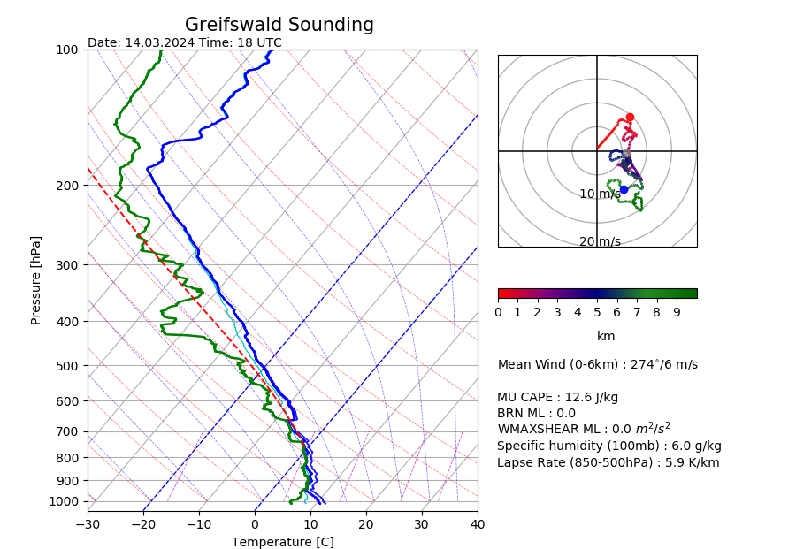
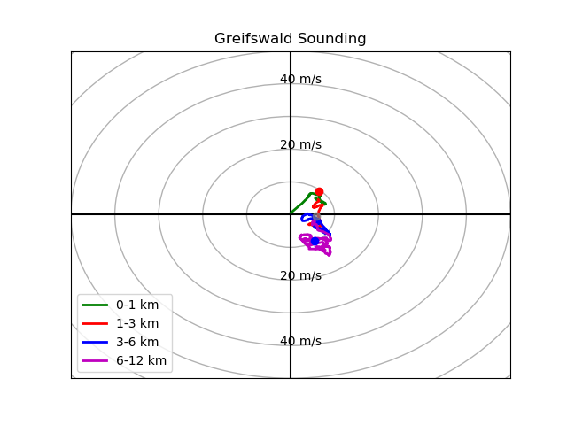

# Sounding Analyze

Actually, a C program to analyze sounding data.
By time graphical output like plots has been added using python3 and matplotlib.

## Installation

**Conda**

```bash
conda env create -f environment.yml

conda activate SoundingAnalyze
```

## Example








